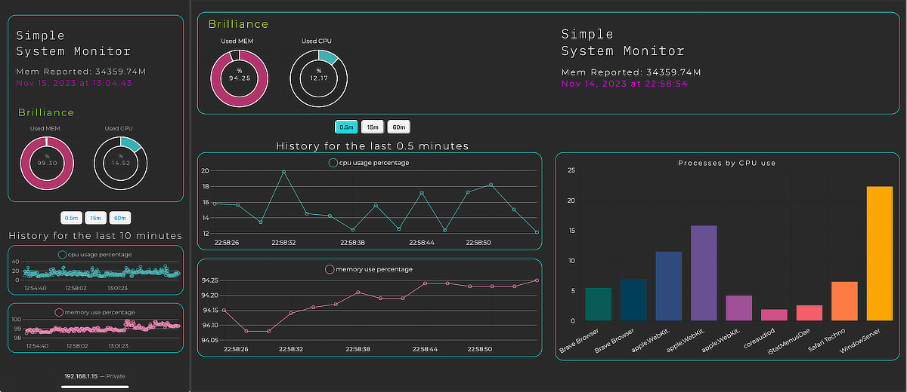

# Nodesysmon

a simple system monitor

[](https://app.codacy.com/gh/echo-dave/nodesysmon/dashboard?utm_source=gh&utm_medium=referral&utm_content=&utm_campaign=Badge_grade) 

v0.6 Rename + web client - ssm and nssm were taken on npm so I've renamed to nodesysmon - this means the git url has changed so you'll need to update url for existing clones. `git@github.com:echo-dave/nodesysmon.git`



[#Installation](#installation) [#Running](#running) [#Tech](#tech)

## Simple System Monitoring

Monitoring realtime CPU, Memory, and process list sorted by cpu / mem

- Server mode for collecting data and sending to db
- local only mode for monitoring current system
- client cli for monitoring via database
- client web monitoring via the server

## Installation

### Requirements

- [node](https://nodejs.org/en) from your package manager of choice.
- [MongoDB](http://mongodb.com) v6+
- Mac or Linux server (untested on Windows but expect issues)

### Install

clone repo to a web directory: /var/www on linux usually

```bash
npm i
npm link #optional for easier access - see Running below
```

### Configuration

You will need to create a new file `.env` in the base folder and add some MongoDB info:

```editorconfig
MONGO_URI=<paste connection string>
MONGO_DB=<name of database you created>
nssmCollection=<name your collection>
```

Running the server should setup the collection if it doesn't already exist and add the indexes

### Running

if linked:
`nodesysmon -s mem=.5 cpu=.8`
otherwise:
`./nodesysmon.js -s mem=.0 cpu=0`
zeroing the thresholds means it will continuously monitor and log processes vs setting a higher threshold to reduce server / db load. Defualt thresholds are set to .5 (50% useage) It should really be setup in a daemon for the server running. [#running as a daemon](#running-as-a-daemon)

Other options:  
 -l for local monitoring no logging  
 -c for cli client reading straigt off the db  
 ./nodesysmon will output help info with no / bad input
connecting via web browser

## Tech

### Package dependencies

- Express
- Chalk for coloring headers, hostname, alerts
- Mongodb for database
- dotenv for Mongodb things
- inquirer for cli prompt for picking which host to monitor
- Sveltekit for the front end web client
- Socketio connecting server and client for realtime data

### How it works

1. The metrics at the top of the screen that continuously monitor cpu and ram is all pulled through native node api.
2. The process list is being pull through bash scripts that do a ps | head | awk that gats parsed out and formatted in node. I suspect ps will be a problem on windows and may need something using taskList? instead from some reading.
3. The 2 sets of metrics are displayed separately but combined into a single object for Mongo.
4. Mongo collection has a TTL index that expires data after 3 days (can be adjusted based on feedback).

## Running as a daemon

This is a basic version for linux servers

First we need a service file to for system to to use  
`sudo touch /lib/systemd/system/nodesysmon.service`

Then we need to put together the basics

- Pick a port that's available on your server
- Set the threshold values as desired

```
[Unit]
Description=nodesysmon
After=Network.target

[Service]
Environment=PORT=3000
Type=simple
User=www-data
WorkingDirectory=/var/www/nodesysmon
ExecStart=nodesysmon mem=0 cpu=0
Restart=on-failure

[Install]
Wantedby=multi-user.target
```

Last we need to tell systemd to actually enable the service  
`sudo systemctl enable nodesysmon.service`
